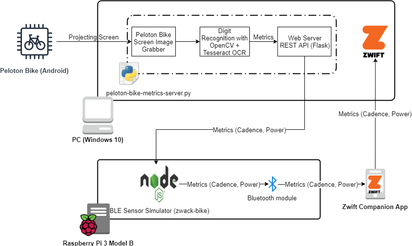

# Zwack Bike BLE

Simulate/Implement a Bluetooth Low Energy sensor that can send Cycling Power and Cadence (CSP Bluetooth profile).

Zwack Bike has many possible uses, here are some examples:

  * Simulate an indoor bike trainer (turbo) generating cyclist power and cadence data to test bike computers fitness or virtual indoor bike apps. 
  * Integrate a common treadmill with Zwift, sending data from the treadmill to the Zwift game via Bluetooth

As an example, the code in this project is used to integrate with [Peloton Bike Metrics Server](https://github.com/iaroslavn/peloton-bike-metrics-server) to allow Peloton Bike owners to take rides on Zwift.  
Diagram of the project:  

# Supports

At this time Zwack runs successfully on Raspberry PI with Bluetooth module (tested on [Raspberry Pi 3 Model B](https://www.raspberrypi.org/products/raspberry-pi-3-model-b/)).

# Requirements
  * Raspberry Pi (theoretically should run in all Bleno (the base BLE module) supported platforms, which are Mac, Windows or Raspberry Pi.)
  * Node.js v8.x (The library we use to communicate over Bluetooth doesn't work with the latest versions of Node.js yet.)
 
Zwack cannot run on the same computer as the fitness or virtual indoor bike app, you'll need to run them on different systems.

# Installation

Make sure you have Node.js **v8.x** installed.

On Raspberry Pi it can be installed like this:
    
    curl -sL https://deb.nodesource.com/setup_8.x|sudo -E bash -
    sudo apt-get update
    sudo apt-get install -y nodejs
    sudo apt-get install -y build-essential

Clone this repo and run 

    npm install

# Debug Flags

You can see a lot of debug information if you run the simulator or your app with the DEBUG environment variable set to 

  * csp - Cycling Power and Cadence messages
  * ble - Bluetooth low energy messages

Example:

    DEBUG=rsc npm run simulator

You'll see something similar to this

    rsc [Zwack notifyRSC] {"speed":4.4703888888888885,"cadence":180} +0ms
    rsc Running Speed: 4.4703888888888885 +2ms
    rsc Running Cadence: 180 +0ms
    rsc [Zwack notifyRSC] {"speed":4.4703888888888885,"cadence":180} +1s
    rsc Running Speed: 4.4703888888888885 +0ms

# Using the simulator

This simulator requires a connection to the Metrics server (can be any HTTP endpoint) that returns metrics as a JSON document:

    {"cadence": 85, "power": 102}

*NOTE: If you wish to use a standalone simulator please have a look at [zwack](https://github.com/paixaop/zwack).*

Start the simulator by executing:

    npm run simulator -- --server=http://<YOUR METRICS SERVER URL>

E.g.:

    npm run simulator -- --server=http://192.168.1.213:5000/metrics

On a different machine start your fitness app, bike computer or indoor virtual bike simulation software, like Zwift, and pair up the Zwack BLE sensor. The sensor name should be `Zwack`, it may have some numbers added to the name or you may see the hostname of the computer running zwack. It all depends on the operating system you're uing to run Zwack.

If your indoor biking software does not detect the BLE sensor, disable, then enable, the Bluetooth on the machine where Zwack is running and retry to discover and connect to the sensor again.

The ZwackBLE sensor may show up as `Zwack` or has the hostname of the machine running Zwack. This is normal.

Press `x` or `q` to exit Zwack.

# Donations
If you like this project, please consider doing the following:
* Starring on GitHub
* [Buying me a coffee](https://www.buymeacoffee.com/iaroslav)

# Credits

Initial prototype based on [zwack](https://github.com/paixaop/zwack) code from [paixaop](https://github.com/paixaop).